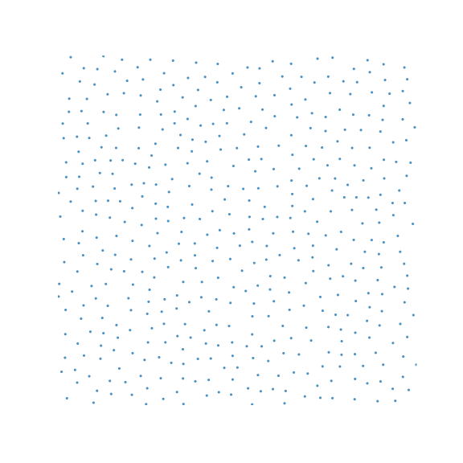

# Pach2



## The Good

* Minimum euclidean distance: `n`
* Minimum object distance: `n`
* Guarantees a sample within '2*n` in block distance: 
* No tiles
* Infinite
* Every cell has a sample
* O(1) very fast initialization
* O(1) very fast sampling of any arbitrary cell, no need to evaluate neighbor cells (need to benchmark)
* Placing a square of size n in every sample fills up a whooping 49% of the space. This is the best fill I have accomplished yet.
* It looks great and random 

## The Bad

* Not suitable for blue noise sampling?
* Not maximal, there are holes
* Not regular, even rows and even columns are more likely to have samples than odd ones.
* There are subtle patterns in the generated samples, can you spot them?

# How to run it

I wrote it in .Net core,  and provided a sample program to run the algorithm.
1) clone this repo
2) install [.net](https://dotnet.microsoft.com/download)
3) run the sample program

```sh
dotnet run Program --pach2
```

That produces samples within the first 30x30 cells in CSV format

# How does it work?

When finding the sample for a cell at (x,y), I calculate the row and column of the cell.  Based on that, I classify the cells into 4 groups, each one has their own sampling algorithm.

## Even row, Even Column

This is the simplest case, for these cells I generate a random sample within the cell.  

I also generate 2 random values (r1, r2) between `[0,cellSize) to be used later.

This is what it looks like if I only take into account even rows and cols:


Since the even/even cells are at least 2 cells appart from each other, there is no possible way for them to produce samples with object distance less than n.


