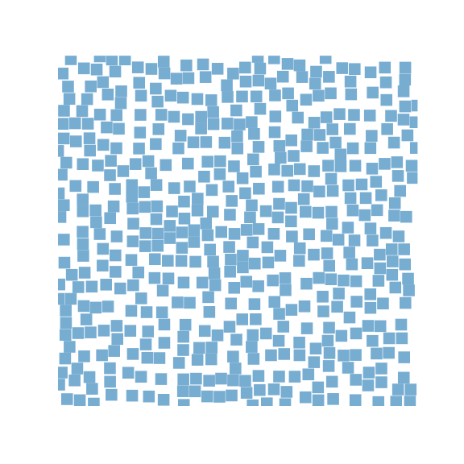
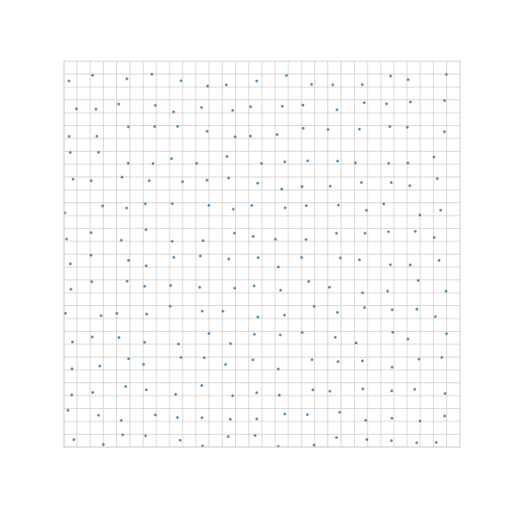
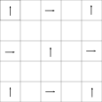
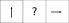
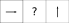
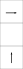
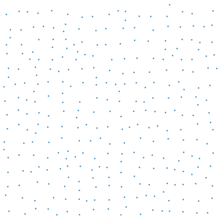

# Pach2

## The Good

* Minimum euclidean distance: `n`
* Minimum square distance: `n`
* Guarantees a sample within '2*n` in square distance: 
* No tiles
* Infinite
* Every cell has a sample
* O(1) very fast initialization (5ns)
* O(1) sampling of any arbitrary cell (96 ms for 1 million samples)
* finds 92% of valid samples in a given area
* It looks great and random

## The Bad

* Not suitable for blue noise sampling?
* Not maximal, there are holes
* Not regular, even rows and even columns are more likely to have samples than odd ones.

# How does it work?

When finding the sample for a cell at (x,y), I calculate the row and column of the cell.  Based on that, I pick one of 4 sampling algorithms.

## Even row, Even Column (EE)

This is the simplest case, for these cells I generate a random sample within the cell.  

This is what it looks like if I only take into account even rows and cols:

Every EE cell gets assigned either a horizontal or a vertical polarity in such way that they alternate:

For the vertical polarity EE I generate 2 additional random numbers, `y1` and `y2` in the range `[0,n)`

For the horizontal polarity EE I generate 2 additional random numbers, `x1` and `x2` in the range `[0,n)`

The polarity and random numbers are used in the EO and OE cells

## Even row, odd column (EO)

In this case, the cell is between two EE cells in the same row. 

If the EE cell on the left has vertical polarity, then the EE on the right will have horizontal polarity.

In this case the sample will be placed `(Min(right.x1, right.x2), left.y2)` as long as it does not conflict with either left or right samples.

If the EE cell on the left has horizontal polarity, then the EE on the right will have horizontal polarity.

In this case the sample will be placed `(Max(left.x1, left.x2), right.y1`)` as long as it does not conflict with either left or right samples.

## Odd row, even column (OE)

In this case, the cell is between two EE cells in the same column. 

If the EE cell on the bottom has vertical polarity, then the EE on the top will have horizontal polarity.

In this case the sample will be placed `(top.x1, Max(bottom.y1,bottom.y2))` as long as it does not conflict with either EE sample.

If the EE cell on the bottom has horizontal polarity, then the EE on the top will have vertical polarity.

In this case the sample will be placed `(Min(top.y1, top.y2), bottom.x2`)` as long as it does not conflict with either EE sample.

Notice that the samples at the top and bottom of an horizontal EE will be at least n points horizontally with the samples at the left and right. 
Notice that the samples at the top and bottom of a vertical EE will be at least n points vertically with the samples at the left and right.

Between the EE, EO and OE, we get a lot of non conflicting samples, but we have not placed any samples in OO cells, so that leaves an ugly grid like shape with holes in the middle:

## Odd row, odd column (OO)

These rows are intuitively simple.  I just calculate all samples in the neighbor 8 cells,  and find a sample that does not conflict with any of them,  if possible. End result:

Ping me if you can come up with an algorithm to do that simpler than mine.
