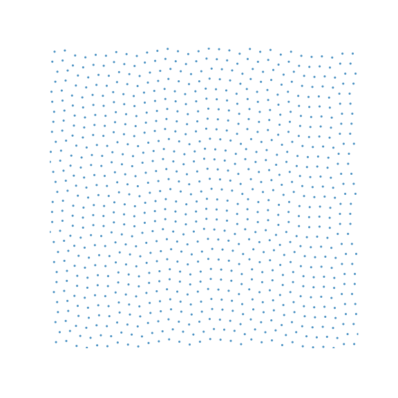
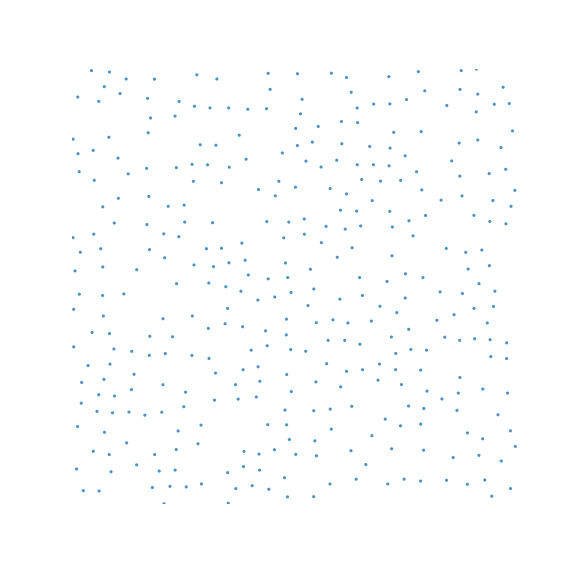

# Procedural object placement

| | Pach1 | Pach2 | Pach3 | Pach4 |
|-|-------|-------|-------|--------|
| |  |  |  |  |
| Min Square Distance| n/2 :x: | n :white_check_mark: | n :white_check_mark: | n :white_check_mark: | 
| Min Euclidean Distance | n/sqrt(2) :x: | n :white_check_mark: | n :white_check_mark: | n :white_check_mark:|
| Initialization Benchmark | 0.08ns :white_check_mark: | 0.007ns :white_check_mark: | 0.007ns :white_check_mark: | 6,450,032 ns (6 ms) O(n*n) :x: |
| 1M samples benchmark | 29.51 ms :white_check_mark: | 70.34 ms :x: | 58.72 ms :x: | 14.84 ms :white_check_mark: |
| Memory use | 8 B :white_check_mark: | 8 B :white_check_mark: | 8 B :white_check_mark: | 786,432 B O(n*n) :x: |
| Tiled | No :white_check_mark: | No :white_check_mark: | No :white_check_mark: | Yes :x: |
| Maximal | 100% :white_check_mark:| 92% :white_check_mark:| 50% :x: | 100% :white_check_mark:|
| Quality | C :x: | A :white_check_mark:| B :x: | A :white_check_mark:|

Here I present 4 algorithms I invented for placing square objects on a plane such that they don't touch each other.  The algorithms are named after me, and all have different pros and cons, which I present in the table above.

I am making a game with procedural world generation.
In this game, I want to generate villages.
In each village, I want to place houses, fountains, wells, churches, etc...

I can just place random structures in random places in the village,  however this looks terrible because I my put two houses too close to each other and they might overlap.

I can place them on a grid making sure that each structure stays in it's assigned cell. But this is not interesting enough for players. The objects should be placed in seemingly random places.

I have not come up with the absolute perfect solution yet, but I invented 4 algorithms for procedural object placement with different advantages.

## Shape of objects

The shape of objects I am placing matters.  If the objecs are circular, then I must enforce that the distance between two objects is at least some k (euclidian distance between the centers).

In my game, the objects are square in shape, and I must ensure that these squares don't overlap.  Some algorithms work better with squares while others work better with distance. Notice that if squares of size n don't touch, then by necessity, the minimum distance between two objects is n, since every square has inside a circle of radius `n/2`.

These algorithms assume all objects are of the same size.  One could generate multiple layouts for the different object sizes and place the large objects first.

## Square distance

Given 2 points (x1,y1) and (x2,y2):

* _Euclidean distance_ is the distance between 2 points in a straight line.  It is given by the formula `sqrt((x2-x1)^2 + (y2-y1)^2)`
* _Manhattan distance_ is the distance that a taxi cab would travel to go from one place to another in a city,  that is it can only travel east-west or north-south, it is given by the formula `|x2-x1| + |y2-y1|`
* _Square distance_,  I made this up, but since I am placing squares, I want to measurement of distance that can be used to calculate how close squares are to each other. For my purpose, I define square distance  as `object distance = Max(|x2-x1|, |y2-y1|)`.  Two squares of size n intersect if and only if `object distance < d`.  Another way to look at it is how big of a square can you fit between the points. 

## Cells

All of these algorithms place objects in cells.  The cells have a size `cellSize * cellSize`, typically 256.  I use cell sizes that are powers of 2 because I can do bit operations instead of more expensive divisions and reminders,  but these can be generalized for any cell size.
The general interface of these algorithms is:  you provide a coordinate (x,y) and they return a tripplet (x',y',valid)  where (x',y') are the coordinates of the sample in that cell, and valid is true if there is a sample and false otherwise. 
There are no more than one sample per cell.

## Tiles vs no tiles

Ideally one would be able to get the object in any arbitrary cell in an infinite plane.
Some algorithms are limited to only a finite plane, however they can be extended to an infinite plane by using tiles.
A tile is a precalculated finite map of placed objects that can be repeated over and over to cover the entire plane.

Tiles are not ideal, large tiles require large amounts of memory, and expensive to initialize. Small tiles may produce repeating patterns. 
The ideal algorithm would not require tiling.

## Multiplayer friendly

I am specifically looking for an algorithm that I can use for my multiplayer name.  I require both the client and the server to generate the same samples. This adds 2 requirements:

1) Seeded.  All object placements must be derived from a single 32 bit seed,  so as long as the server and the client have the same seed, they get the same samples. I use a Pseudo random noise function called [Squirrel3](https://www.youtube.com/watch?v=LWFzPP8ZbdU), as a basis for my seeded random number generator, but other noise functions would work fine.
2) No floating point math. This is a big problem because different platforms and even different compilers might produce slightly different results when doing floating point math.  All math must be done exclusively with integer math that is consistent accross platforms and compilers.

## Density and Maximality

If all objects are placed in a grid with cell size equal to the object's size, then they fill up 100% of the space.
But that is not really a goal,  objects should be scattered randomly, not in a grid. I do want some random space between them.

My ideal algorithm would fill the space in such way that no more objects can be placed. That means that the distance between a point and the nearest point is never more than the size of the squares.  I haven't come up with a way to measure this type of coverage yet.

