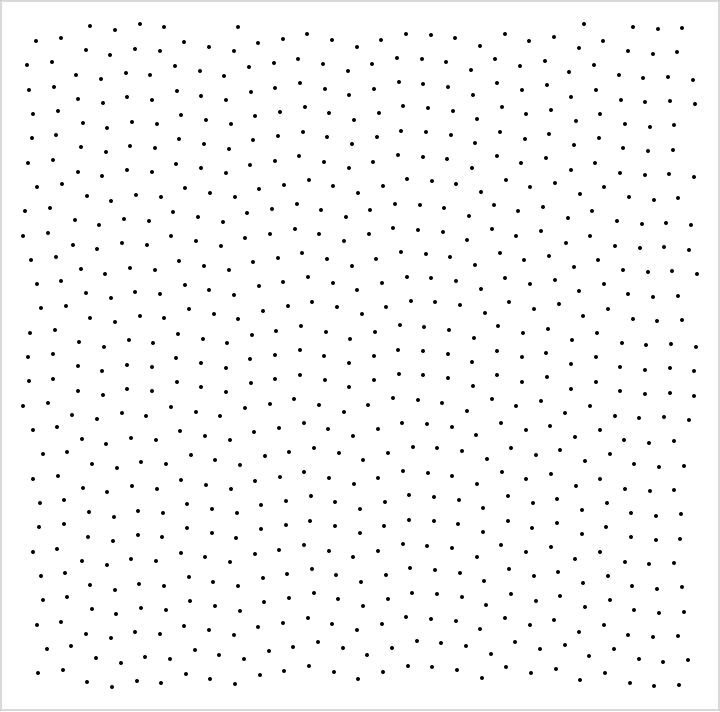

# Blue Noise

An algorithm that generates random points in the plane with a minimum distance between them

It is a modification of the algorithm proposed by [Dr. Roberts](http://extremelearning.com.au/isotropic-blue-noise-point-sets/).



# Improvements

Besides the features described in the [original article](http://extremelearning.com.au/isotropic-blue-noise-point-sets/), this version has the following features:

* Infinite plane with no repeating patterns 
* No storage needed (no precomputed tiles or permutations)
* O(1) very fast initialization
* O(1) very fast sampling of any arbitrary cell, no need to evaluate neighbor cells
* only integer math is required
* No divisions, only bit shifts. I achieve this by restricting cell sizes to powers of 2

You can find the algorithm in [BlueNoiseSampler.cs](BlueNoiseSampler.cs)

# How to run it

I wrote it in .Net core,  and provided a sample program to run the algorithm.
1) clone this repo
2) install [.net](https://dotnet.microsoft.com/download)
3) run the sample program

```sh
dotnet run Program.cs
```

# How does it work?

First you should understand how the [original article](http://extremelearning.com.au/isotropic-blue-noise-point-sets/) works. 

Long story short: Dr. Roberts calculates what he calls "balanced permutations", and uses them to shuffle rows and columns of a cannonical grid layout.

## Balanced sequences

Instead of balanced permutations I build "balanced sequences".   
A balanced sequence is a infinite sequence of numbers `s(i)` such that `0 <= s(i) < n` and `|s(i+1) - s(i)| <= n / 2`
A balanced sequence is pseudorandom, with no discernible pattern.
A balanced sequence is repeatable,  meaning that if I evaluate `s(i)` more than once, I get the same result.

For example,  if n = 8, a valid fraction of a balanced sequence would be:
```..., 0, 4, 3, 7, 6, 3, 2, 5, 6, ...```

But the following would not be a balanced sequence:
```..., 0, 8, ....```

because the difference between 0 and 8 is greater than n/2

I use 2 separate balanced sequences,  one for rows and one for columns.

To evaluate s(i):
if i is odd,  I simply get a pseudo random number between [0,n) using [Squirrel3](https://www.youtube.com/watch?v=LWFzPP8ZbdU).
if i is even, I get the value of s(i-1) and s(i+1), then calculate the range of numbers that would be valid, and pick one randomly using [Squirrel3](https://www.youtube.com/watch?v=LWFzPP8ZbdU)
Note that any other Noise function would work just fine.

Here is the implementation of my [BalancedSequence](BlueNoiseSampler.cs#L61)

Here is my implementation of [Squirrel3](SquirrelNoise.cs)

## Picking rows and columns.

When calculating the value for a cell at x,y,  first I calculate the row and column by dividing by the cell size (I use bit shift since my cell sizes are powers of 2)
then I use the row to sample a balanced sequence for rows and the column for. 


