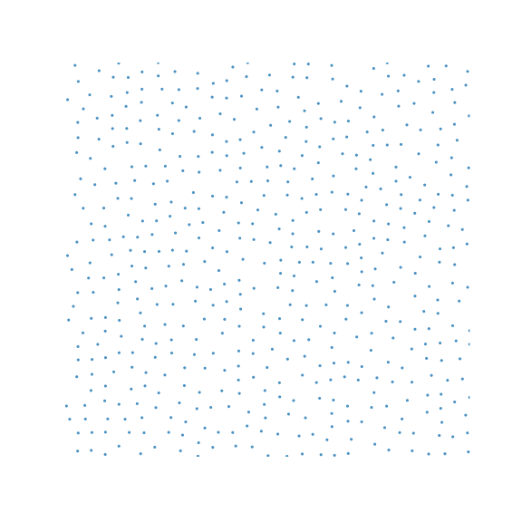

# Procedural object placement

| | Pach1 | Pach2 | Pach3 | Pach4 |
|-|-------|-------|-------|--------|
| |  |  |  |  |
| Min [Square Distance](SquareDistance.md)| n/2 :x: | n :white_check_mark: | n :white_check_mark: | n :white_check_mark: | 
| Min Euclidean Distance | n/sqrt(2) :x: | n :white_check_mark: | n :white_check_mark: | n :white_check_mark:|
| (Initialization Benchmark)[InitBenchmark.md] | 4.7 ns :white_check_mark: | 4.6 ns :white_check_mark: | 4.7 ns :white_check_mark: | 6 ms O(n*n) :x: |
| (1M samples benchmark)[1MBenchmark.md] | 29.822 ms :white_check_mark: | 96.02 ms :x: | 61 ms :x: | 9.9 ms :white_check_mark: |
| (Memory use)[memory.md] | 8 B :white_check_mark: | 8 B :white_check_mark: | 8 B :white_check_mark: | 786,432 B O(n*n) :x: |
| (Tiled)[Tiles.md] | No :white_check_mark: | No :white_check_mark: | No :white_check_mark: | Yes :x: |
| (Maximal)[Maximal.md] | 100% :white_check_mark:| 92% :white_check_mark:| 50% :x: | 100% :white_check_mark:|
| (Randomness)[Randomness.md] | C :x: | A :white_check_mark:| B :x: | A- :white_check_mark:|
| (Repeatable)[Repeatable.md] | Yes :white_check_mark: | Yes :white_check_mark: | Yes :white_check_mark: | Yes :white_check_mark: |

Here I present 4 algorithms I invented for placing square objects on a plane such that they don't touch each other.  The algorithms are named after me, and all have different pros and cons, which I present in the table above.

I am making a game with procedural world generation.
In this game, I want to generate villages.
In each village, I want to place houses, fountains, wells, churches, etc...

I can just place random structures in random places in the village,  however this looks terrible because I my put two houses too close to each other and they might overlap.

I can place them on a grid making sure that each structure stays in it's assigned cell. But this is not interesting enough for players. The objects should be placed in seemingly random places.

I have not come up with the absolute perfect solution yet although these ones are already good enough for me. 